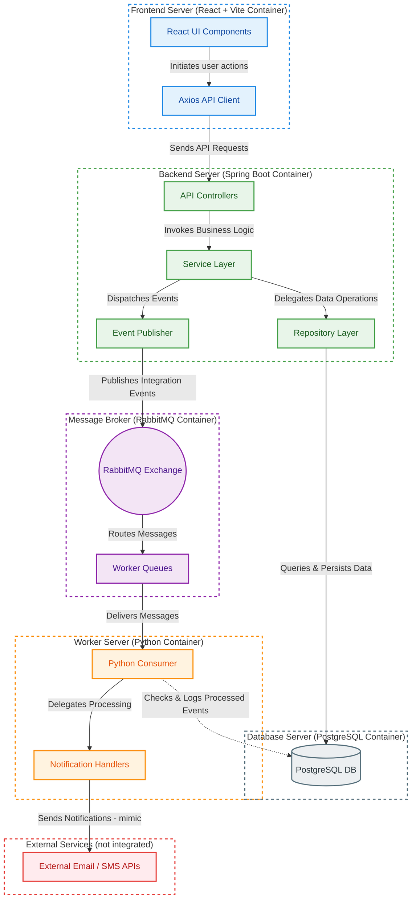
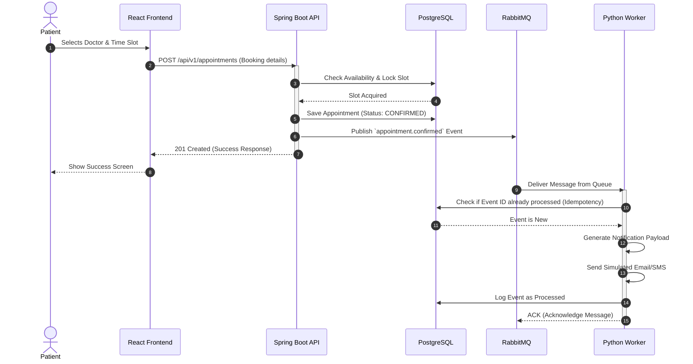
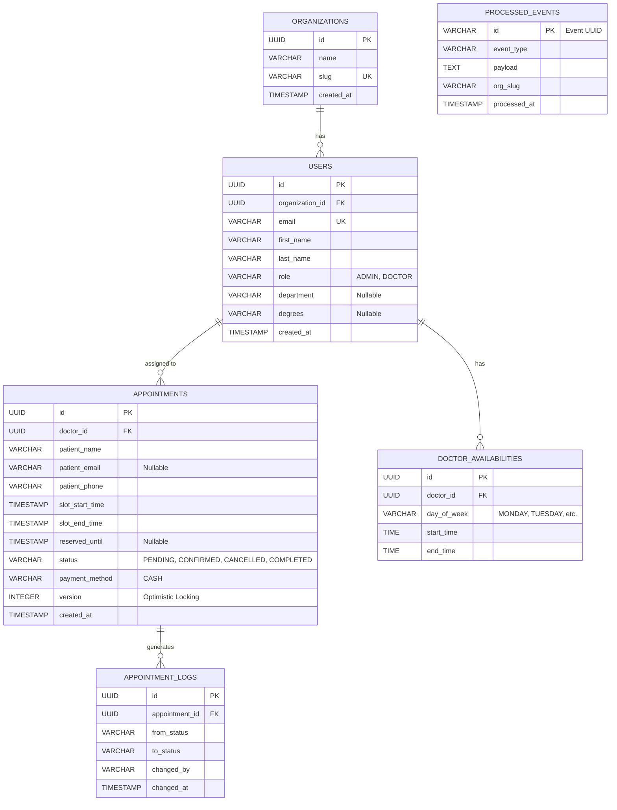

# MedBook - Healthcare Appointment Platform

Welcome to **MedBook**, a modern, event-driven healthcare appointment scheduling platform. This system is architected for high availability, fault tolerance, and clear separation of concerns.

This documentation provides a comprehensive overview of the system's architecture, data flow, database design, and codebase structure, serving as a technical reference for developers and reviewers.

---

## Development Philosophy: A Pragmatic, Phased Approach

When tackling real-world software engineering projects, I avoid the trap of over-engineering a complex, multi-tenant system on day one. Instead, I follow a disciplined, iterative development methodology focused on **validating core business logic early, mitigating architectural risk, and scaling incrementally.**

This project was deliberately designed and executed in distinct, logical phases to mirror how I approach production-grade software delivery:

### Phase 1: Core Engine & Foundational Reliability (The MVP)

* **Objective:** Establish a rock-solid, single-tenant Minimum Viable Product (MVP) to validate the core appointment booking domain logic.
* **Key Focus:** Designed the foundational database schemas for users, doctor availability, appointments, and audit trails (appointment logs). Crucially, I implemented a `processed_events` table in this phase to guarantee **worker idempotency** from day one, ensuring the event-driven architecture was reliable before scaling out.

### Phase 2: Transition to a Multi-Tenant SaaS Architecture

* **Objective:** Evolve the monolithic, single-tenant data model into a scalable SaaS platform.
* **Key Focus:** Introduced the concept of `Organizations` and decoupled data access by enforcing strict **tenant isolation** via a unified `tenant_id` across all core tables. To simulate a real-world migration, I designed a default organization migration path to seamlessly transition Phase 1 data without breaking existing schemas.

### Phase 3: UX-Driven Schema Evolution & Flexibility

* **Objective:** Adapt the system's strict constraints to adapt to real-world user behavior and business requirements.
* **Key Focus:** Based on typical clinical user-testing feedback (where some patients only provide phone numbers), I safely relaxed database constraints to make patient emails optional, proving the system's design can adapt to shifting product requirements without destabilizing the core API contracts.

### Phase 4: High-Concurrency & Race Condition Prevention

* **Objective:** Protect data integrity against duplicate bookings during peak traffic loads.
* **Key Focus:** Solved concurrent booking conflicts by implementing a **temporary slot-locking mechanism**. This holds and secures an identical slot while a specific user completes their checkout workflow, gracefully mitigating race conditions.

### Phase 5: Tenant-Isolated Event Routing & Rich Telemetry

* **Objective:** Enterprise-grade observability and secure background processing for asynchronous workers.
* **Key Focus:** Upgraded the messaging event payload to include tenant organization slugs and deep event contextual metadata. This enables the background Python worker to perform tenant-specific message isolation, secure routing, and highly granular, organization-level audit logging.

---

### Why This Approach Matters in Production

By breaking development into these phases, I ensure that:

1. **Infrastructure cost and complexity** scale linearly with business needs.
2. **Breaking changes are managed through clear deprecation paths** rather than chaotic rewrites.
3. **Core system stability** is verified before layering on complex architectural requirements like multi-tenancy or high-concurrency handling.

---

## 1. Getting Started Locally

### Prerequisites
- Docker & Docker Compose
- Java 17+ (Optional, if running backend natively)
- Node.js 18+ (Optional, if running frontend natively)
- Python 3.10+ (Optional, if running worker natively)

### Bootstrapping the Environment
The application can be run in either **Development Mode** (default) or **Production Mode** using Docker Compose. This is controlled by the `SPRING_PROFILES_ACTIVE` environment variable.

#### Changing Modes
Open the `.env` file located at the root of the project folder and change the `SPRING_PROFILES_ACTIVE` variable to switch between modes:
- **Development (with API Docs):** Set `SPRING_PROFILES_ACTIVE=dev`
- **Production (without API Docs):** Set `SPRING_PROFILES_ACTIVE=prod`

Then simply start the containers:
```bash
docker compose up --build
```

---

## 2. System Architecture

MedBook is built as a microservices-oriented monorepo consisting of three core components communicating asynchronously. 

The primary goal of this architecture is to ensure that the core booking engine (Backend) is highly available and responsive, while heavy or failure-prone tasks (like sending emails or SMS notifications) are offloaded to background workers.



### Components:
- **Frontend Server (React + Vite)**:
  - **React UI Components**: Render the user interface and handle client-side state/routing.
  - **Axios API Client**: Initiates HTTP requests to the backend.
- **Backend Server (Spring Boot / Java)**:
  - **API Controllers**: Expose REST endpoints to the frontend.
  - **Service Layer**: Implements transactional business logic (e.g. slots, booking).
  - **Repository Layer (Spring Data JPA)**: Coordinates data access with the database.
  - **Event Publisher**: Publishes integration events to the message broker.
- **Database Server (PostgreSQL)**:
  - Persists tables (Users, Appointments, Logs) and processes idempotency checks.
- **Message Broker (RabbitMQ)**:
  - **RabbitMQ Exchange**: Receives and routes integration events.
  - **Worker Queues**: Holds messages for async worker processing, including DLQ & retries.
- **Worker Server (Python)**:
  - **Python Consumer**: Pulls messages from RabbitMQ queues and coordinates idempotency checks.
  - **Notification Handlers**: Builds payloads and dispatches notification tasks.
- **External Services (not integrated)**:
  - Downstream Email and SMS APIs that receive notification payloads.

---

## 3. Data Flow Diagram (Booking Process)

The following sequence demonstrates the event-driven data flow when a patient books an appointment. Note how the HTTP request completes quickly, while side effects happen asynchronously.



---

## 4. Database Design

The relational database is designed to enforce data integrity at the schema level. We use PostgreSQL to manage Users, Appointments, and outbox/processed event logs.



### Key Database Highlights:
1. **Concurrency Control**: The `APPOINTMENTS` table includes a `version` column utilized by Spring Data JPA's `@Version` annotation to implement Optimistic Locking.
2. **Zero Double-Booking Guarantee**: A database-level partial unique index exists on `(doctor_id, start_time)` where `status != 'CANCELLED'`.
3. **Idempotency**: The `PROCESSED_EVENTS` table prevents the Python worker from processing the same RabbitMQ message twice if network partitions cause a redelivery.

---

## 5. Folder Structure & Purpose

The monorepo is divided into clear boundaries. Below is the directory structure and the specific purpose of each folder.

```text
healthcare-appointment-platform/
├── backend/                        # [Java 17 + Spring Boot 3] Core API & System of Record
│   ├── src/main/java/.../appointment/
│   │   ├── config/                 # App config (RabbitMQ, Security, OpenAPI, CORS)
│   │   ├── controller/             # REST API Endpoints exposed to the frontend
│   │   ├── dto/                    # Data Transfer Objects for Request/Response validation
│   │   ├── event/                  # RabbitMQ Event Publishers & internal Spring Events
│   │   ├── exception/              # Global error handlers (@ControllerAdvice) and custom exceptions
│   │   ├── mapper/                 # Entity <-> DTO conversion logic (e.g., MapStruct or manual)
│   │   ├── model/                  # JPA Database Entities (Users, Appointments, etc.)
│   │   ├── repository/             # Spring Data JPA Interfaces
│   │   ├── security/               # JWT Filters, Authentication providers, and UserDetails
│   │   └── service/                # Core Business Logic & Transactional boundaries (@Service)
│   ├── src/main/resources/         
│   │   ├── db/migration/           # Flyway SQL migration scripts (Schema version control)
│   │   └── application.yml         # Spring Boot environment properties
│   └── pom.xml                     # Maven dependencies
│
├── worker/                         # [Python 3] Background Consumer Service
│   ├── app/
│   │   ├── consumers/              # RabbitMQ consumers (Base consumer + Domain-specific handlers)
│   │   ├── config.py               # Environment variables & RabbitMQ Queue topology definitions
│   │   ├── db.py                   # SQLAlchemy database connection setup
│   │   ├── main.py                 # Worker entry point and orchestrator
│   │   └── models.py               # SQLAlchemy DB models for idempotency checks
│   ├── tests/                      # Pytest unit and integration tests
│   ├── Dockerfile                  # Containerization instructions for the worker
│   └── requirements.txt            # Python dependencies (pika, sqlalchemy, pydantic)
│
├── frontend/                       # [React + Vite + TS] User Interface
│   ├── src/
│   │   ├── api/                    # Axios instances and API call functions
│   │   ├── components/             # Reusable UI elements & complex views (Booking, Admin)
│   │   ├── constants/              # Static constants, Enums, and configurations
│   │   ├── hooks/                  # Custom React Hooks (useAuth, API fetching)
│   │   ├── types/                  # TypeScript interfaces matching backend DTOs
│   │   ├── utils/                  # Helper functions (Date formatting, validation)
│   │   ├── App.tsx                 # Main application routing & layout
│   │   ├── index.css               # Global CSS styles
│   │   └── main.tsx                # React DOM entry point
│   ├── package.json                # NPM dependencies
│   └── vite.config.ts              # Bundler configuration
│
├── docs/                           # Architectural & API Documentation
│   ├── api-documentation.html      # OpenAPI HTML representation (Swagger UI export)
│   ├── api-documentation.json      # OpenAPI 3.0 specification file in JSON format
│   ├── event-contracts.md          # Canonical message contract definitions for RabbitMQ
│   └── technical-specification.md  # Detailed system behavior and technical specs
│
├── docker-compose.yml              # Orchestrates local environment (Postgres, RabbitMQ, Services)
└── README.md                       # This documentation file
```

---

## Reference Sheet: Important URLs & Profiles

- **Frontend App**: [http://localhost:3000](http://localhost:3000)
- **Backend API Docs (Swagger)**: [http://localhost:8080/swagger-ui/index.html](http://localhost:8080/swagger-ui/index.html) *(Only available when running in **Development Mode**)*
- **Offline API Documentation (HTML)**: [docs/api-documentation.html](docs/api-documentation.html) (or preview via [GitHub HTML Preview](https://htmlpreview.github.io/?https://github.com/amjadcp/healthcare-appointment-platform/blob/main/docs/api-documentation.html))
- **Offline API Specification (JSON)**: [docs/api-documentation.json](docs/api-documentation.json)
- **RabbitMQ Management**: [http://localhost:15672](http://localhost:15672) (User: `guest`, Pass: `guest`)
